# 中小企业员工考勤与薪资核算管理系统


> 基于 **Spring Boot + Vue 3** 的前后端分离项目，实现员工管理、考勤打卡、请假/加班审批、薪资规则配置与工资自动核算。
>
> **开箱即用**：默认使用内嵌 H2 数据库，无需安装 MySQL，启动即可登录使用；也支持一键切换 MySQL。

## 🖼️ 界面预览

| 登录 | 首页仪表盘（管理员） |
| :---: | :---: |
| 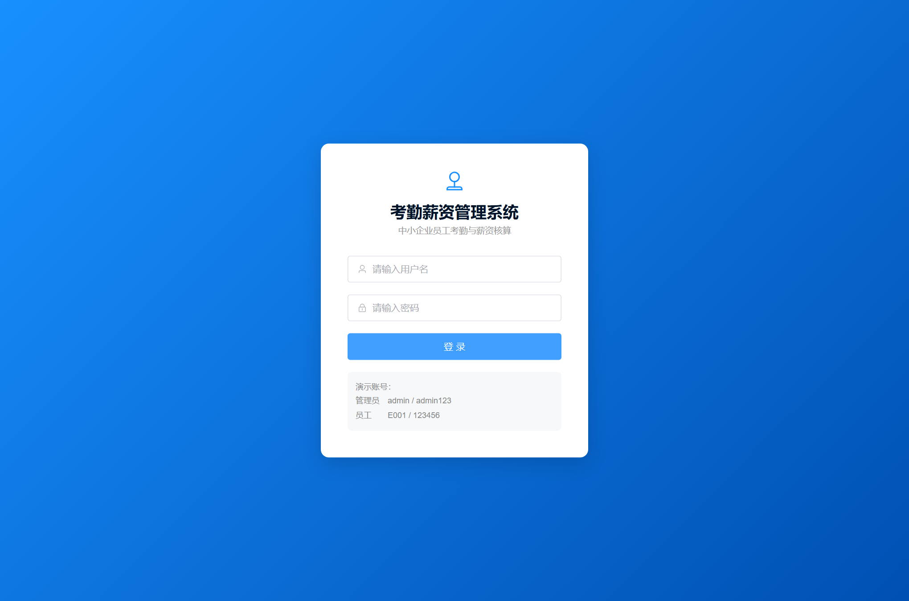 | 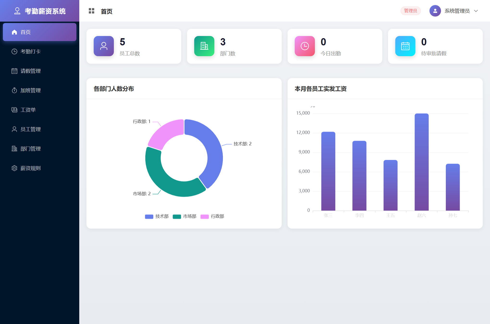 |

| 员工管理 | 工资单 |
| :---: | :---: |
| 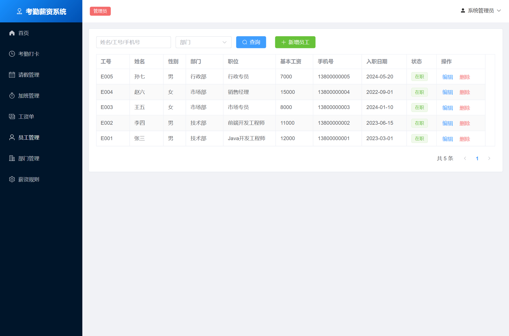 | 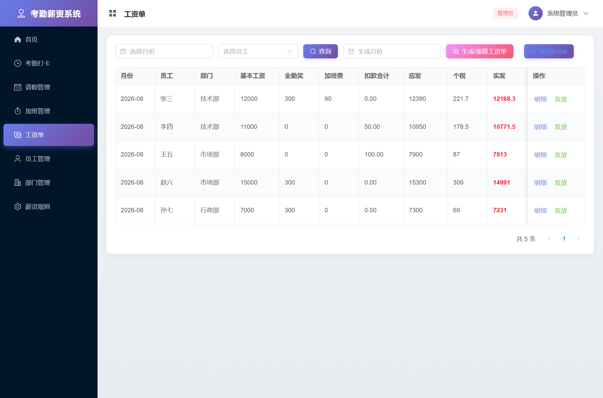 |

| 考勤管理（列表） | 考勤管理（月历） |
| :---: | :---: |
| 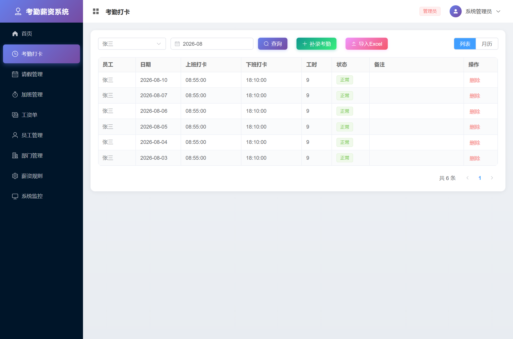 | 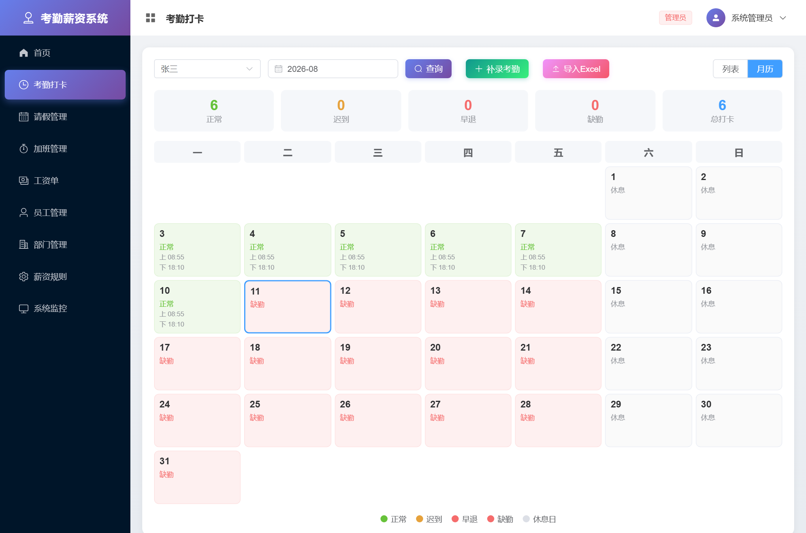 |

| 部门管理 | 薪资规则 |
| :---: | :---: |
| 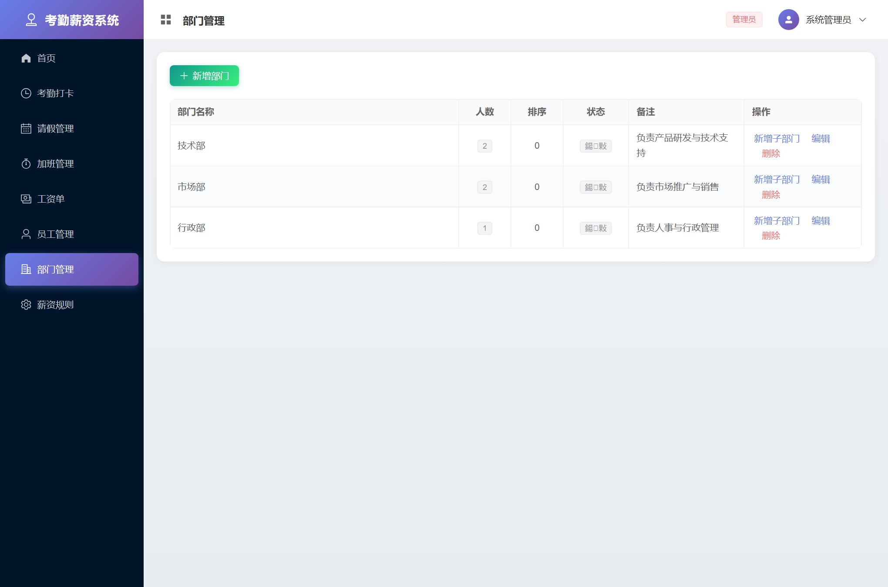 | 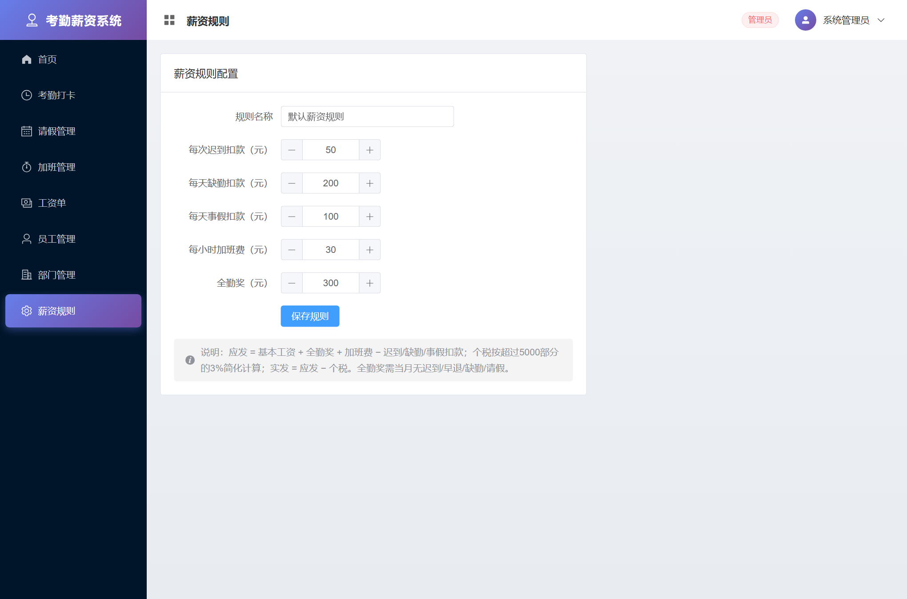 |

| 请假管理 | 加班管理 |
| :---: | :---: |
| 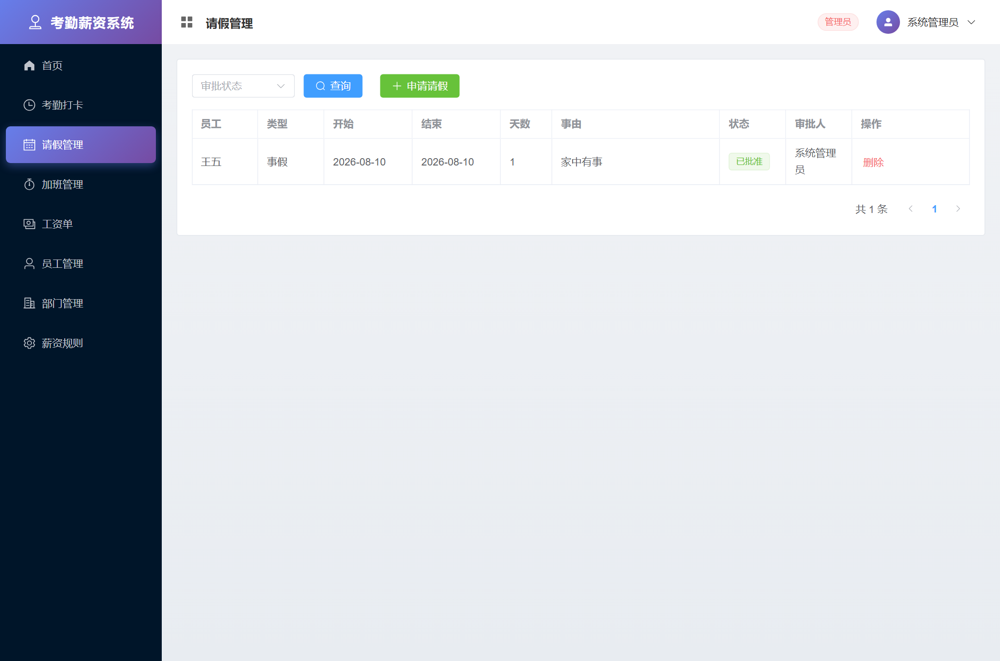 | 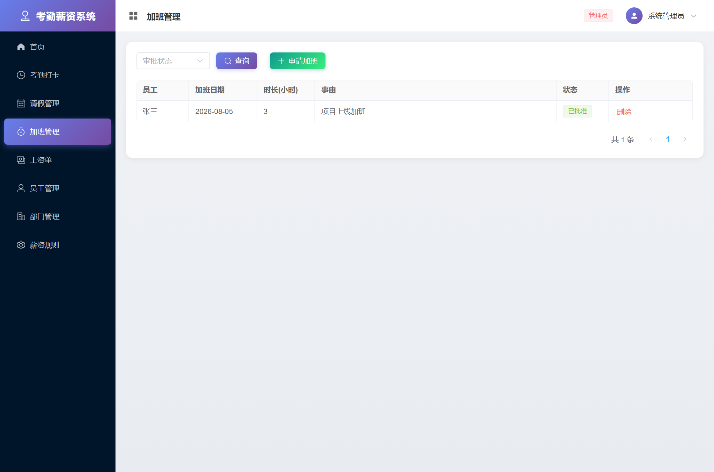 |

| 系统监控 | 考勤管理（月历） |
| :---: | :---: |
| 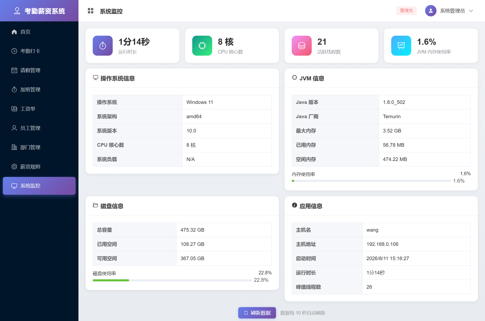 |  |


---

## 📝 更新日志

### v1.9.0 - 2026-08-11
**操作日志功能**
- 📋 新增操作日志页面（仅管理员可见）
- 🔍 AOP 切面自动记录所有写操作（新增/修改/删除）
- 👤 记录操作人、操作模块、操作类型、请求参数、IP 地址
- ⏱️ 记录操作耗时、操作状态（成功/失败）、错误信息
- 🔎 支持按模块、操作人、状态多条件筛选查询

### v1.8.0 - 2026-08-11
**多租户支持**
- 🏢 新增租户（企业）管理功能（仅管理员可见）
- 👥 用户表增加 tenant_id 字段，支持用户与租户关联
- 🔐 登录接口返回租户 ID 和租户名称
- 📊 前端用户状态存储租户信息
- 🔧 支持多企业共用一套系统，为后续数据隔离奠定基础

### v1.7.0 - 2026-08-11
**工作流引擎**
- 🔄 新增工作流审批中心页面
- 📝 支持多级审批流程定义（JSON 配置节点）
- ✅ 发起流程、待我审批、我已审批、我发起的 四大视图
- 📜 审批历史时间线展示，支持查看每级审批意见
- 👥 预置请假审批流程（HR→管理员两级）、加班审批流程（HR一级）
- 🔐 按角色匹配审批人，自动流转到下一级

### v1.6.0 - 2026-08-11
**统计报表功能**
- 📊 新增统计报表页面（仅管理员/人事可见）
- 👥 人员统计：总员工数、部门人数分布、性别比例、薪资区间分布、员工状态
- 📅 考勤统计：总打卡次数、考勤状态分布、各部门考勤对比、出勤率
- 💰 薪资成本：总成本统计、各部门薪资对比、薪资构成分析、人均实发工资
- 📈 ECharts 可视化：饼图 + 柱状图 + 明细表格

### v1.5.0 - 2026-08-11
**系统监控功能**
- 🖥️ 新增系统监控页面（仅管理员可见）
- 📊 实时展示操作系统、JVM、磁盘、应用运行信息
- ⏱️ 每 10 秒自动刷新，支持手动刷新
- 📈 内存/磁盘使用率进度条，颜色随使用率变化（绿/橙/红）
- 🔐 严格权限控制，HR/员工账号不可访问

### v1.4.0 - 2026-08-11
**薪资核算完善**
- 💰 新增社保扣除计算（基本工资 × 社保比例，默认 10.5%）
- 🏠 新增公积金扣除计算（基本工资 × 公积金比例，默认 7%）
- 🧾 新增个税专项附加扣除配置（子女教育/赡养老人等）
- 📊 个税起征点可配置（默认 5000 元）
- 🧮 完善个税计算：应纳税所得额 = 应发 − 社保 − 公积金 − 专项附加扣除 − 起征点
- 📋 工资单页面新增社保、公积金列
- 📤 Excel 导出增加 3 列（社保/公积金/专项附加扣除）
- ⚙️ 薪资规则页面分三组配置，底部显示完整计算规则说明

### v1.3.0 - 2026-08-11
**界面美化与全局样式统一**
- 🎨 全新紫色主题设计，登录页渐变背景 + 装饰元素
- 📊 仪表盘优化：渐变色统计卡片 + ECharts 紫色主题图表
- 🔧 全局样式统一：卡片、表格、按钮、对话框、分页风格一致
- 👤 主布局优化：顶部栏页面标题 + 渐变色用户头像 + 角色标签
- 📱 左侧菜单美化：选中项渐变背景 + 阴影效果
- 💾 所有按钮渐变色 + hover 上浮动效

### v1.2.0 - 2026-08-10
**功能增强**
- 📅 新增考勤月历视图，直观查看每月考勤状态
- 📊 首页新增 ECharts 统计图表（部门人数分布 / 工资柱状图）
- 🔐 新增修改密码功能
- 📤 工资单支持 Excel 导出
- 👥 新增 HR 人事专员角色，细化权限控制
- 🌳 部门管理支持树状结构 + 人数统计
- 📥 员工/考勤支持 Excel 批量导入

### v1.1.0 - 2026-08-09
**基础功能完善**
- ✅ 员工管理 CRUD
- ✅ 部门管理
- ✅ 考勤打卡与统计
- ✅ 请假/加班申请与审批
- ✅ 薪资规则配置
- ✅ 工资自动核算
- ✅ JWT 登录鉴权 + 三级角色

---

## ✨ 功能特性

| 模块 | 功能 |
| --- | --- |
| 登录鉴权 | JWT 登录、管理员 / 人事 / 员工三级角色、接口权限控制、修改密码、**租户信息返回** |
| 首页仪表盘 | 管理员看全局统计 + ECharts 图表；员工看本月考勤统计 |
| 员工管理 | 员工增删改查、按部门/关键字检索、新增员工自动生成登录账号、**Excel 批量导入** |
| 部门管理 | **树状部门结构**、部门人数统计、多级部门、排序/状态管理 |
| 考勤管理 | 员工上/下班打卡、迟到/早退自动判定、管理员补录与查询、**月历视图**、**Excel 批量导入** |
| 请假管理 | 员工提交请假申请、管理员/人事审批（批准/驳回） |
| 加班管理 | 员工提交加班申请、管理员/人事审批 |
| 薪资规则 | 配置迟到/缺勤/事假扣款、加班费单价、全勤奖、**社保比例、公积金比例、个税起征点、专项附加扣除** |
| 工资核算 | 按月自动生成工资单：基本工资 + 全勤奖 + 加班费 − 各项扣款 − **社保 − 公积金 − 个税**，支持重算与发放、**Excel 导出** |
| **统计报表** | **人员统计报表（部门/性别/薪资区间）、考勤统计报表、薪资成本报表，ECharts 可视化（仅管理员/人事）** |
| **工作流引擎** | **多级审批流程定义、发起流程、待办/已办/我发起的、审批历史时间线、支持 HR→管理员两级审批** |
| **多租户支持** | **租户（企业）管理、用户租户关联、登录返回租户信息、支持多企业共用一套系统（仅管理员）** |
| **操作日志** | **AOP 自动记录所有写操作、操作人/模块/IP/耗时/状态、支持按模块/操作人/状态筛选（仅管理员）** |
| 系统监控 | **实时监控系统运行状态**：操作系统/JVM/磁盘/应用信息、内存使用率进度条、自动刷新（仅管理员） |
| 数据导入导出 | 员工 Excel 导入、考勤 Excel 导入、工资单 Excel 导出 |

---

## 🧰 技术栈

**后端**：Spring Boot 2.7 · Spring Security + JWT · MyBatis-Plus · H2 / MySQL 8 · Apache POI · Java 8
**前端**：Vue 3 · Vite 5 · Element Plus · Vue Router · Pinia · Axios · ECharts 5

---

## 🚀 快速开始（三选一）

> 系统要求：任选其一即可运行。为最大兼容性，后端目标为 **Java 8**，各主流操作系统均可运行。

### 方式一：直接运行已打包的 Jar（最简单，只需 JDK 8+）

```bash
# 在 backend 目录下打包（首次需要 Maven，见方式二）后得到 target/hrms.jar
java -jar backend/target/hrms.jar
```

启动后浏览器访问 **http://localhost:8080** ，即为完整系统（前端已内置在 Jar 中）。

### 方式二：本地开发运行（前后端分离）

**1. 启动后端**（需要 JDK 8 + Maven）
```bash
cd backend
mvn spring-boot:run
# 后端运行在 http://localhost:8080
```

**2. 启动前端**（需要 Node 18+）
```bash
cd frontend
npm install
npm run dev
# 前端运行在 http://localhost:5173 ，已配置代理到后端
```

### 方式三：Docker 一键启动（只需 Docker）

```bash
# 默认使用内嵌 H2
docker compose up -d --build
# 访问 http://localhost:8080

# 如需使用 MySQL：
SPRING_PROFILES_ACTIVE=mysql docker compose --profile mysql up -d --build
```

---

## 📦 一键打包完整可运行 Jar

打包会先构建前端并内置到后端，最终生成单一可运行 Jar：

```bash
# 1) 构建前端（产物自动输出到后端静态目录）
cd frontend && npm install && npm run build

# 2) 打包后端（含前端）
cd ../backend && mvn clean package -DskipTests

# 3) 运行
java -jar target/hrms.jar
```

Windows 用户可直接双击运行根目录下的 `build.bat`（构建）与 `run.bat`（运行）。

---

## 🔑 默认账号

| 角色 | 用户名 | 密码 | 说明 |
| --- | --- | --- | --- |
| 管理员 | `admin` | `admin123` | 系统管理员，拥有所有权限 |
| 人事专员 | `hr` | `hr123456` | 人事专员，可管理员工/考勤/工资等 |
| 员工（张三） | `E001` | `123456` | 技术部，Java开发工程师 |
| 员工（李四…孙七） | `E002` ~ `E005` | `123456` | 各部门普通员工 |

> 首次启动会自动初始化 3 个部门、5 名员工及演示考勤/请假/加班数据。
> 新增员工时会自动创建登录账号：**用户名 = 工号，初始密码 = 123456**。

---

## 🗄️ 数据库说明

- **默认（H2）**：零配置，数据保存在 `backend/data/hrms.mv.db`。可访问 `http://localhost:8080/h2-console` 查看（JDBC URL：`jdbc:h2:file:./data/hrms`，用户名 `sa`，密码空）。
- **切换 MySQL**：以 `mysql` profile 启动即可，程序会自动建库建表并灌入演示数据。

```bash
# 通过环境变量覆盖连接信息（含默认值）
#   MYSQL_HOST=localhost MYSQL_PORT=3306 MYSQL_DB=hrms MYSQL_USER=root MYSQL_PASSWORD=root
java -jar target/hrms.jar --spring.profiles.active=mysql \
     --MYSQL_HOST=localhost --MYSQL_USER=root --MYSQL_PASSWORD=你的密码
```

建表脚本见 `backend/src/main/resources/db/schema.sql`（H2 / MySQL 通用），
另附独立参考脚本 `sql/init_mysql.sql`。

---

## 🧮 薪资核算规则

```
应发工资 = 基本工资 + 全勤奖 + 加班费 − 迟到扣款 − 缺勤扣款 − 事假扣款
社保扣除 = 基本工资 × 社保比例（默认 10.5%）
公积金扣除 = 基本工资 × 公积金比例（默认 7%）
应纳税所得额 = 应发工资 − 社保扣除 − 公积金扣除 − 专项附加扣除 − 个税起征点（默认 5000）
个人所得税 = 应纳税所得额 × 3%（应纳税所得额 ≤ 0 时为 0）
实发工资 = 应发工资 − 社保扣除 − 公积金扣除 − 个人所得税
```
- 全勤奖：当月无迟到 / 早退 / 缺勤 / 请假才发放。
- 加班费：仅统计**已批准**的加班；事假扣款仅统计**已批准**的事假。
- 社保、公积金按基本工资为基数计算，比例可在「薪资规则」页面配置。
- 专项附加扣除：子女教育、赡养老人等，可在「薪资规则」页面统一配置默认值。
- 各项参数可在「薪资规则」页面自定义。

---

## 📁 项目结构

```
attendance-salary-system/
├── backend/                      # Spring Boot 后端
│   ├── src/main/java/com/example/hrms/
│   │   ├── config/               # 安全、MyBatis-Plus、数据初始化配置
│   │   ├── security/             # JWT 与 Spring Security
│   │   ├── entity/ mapper/ service/ controller/   # 分层代码
│   │   └── common/               # 统一返回、异常处理
│   └── src/main/resources/
│       ├── application.yml        # H2 / MySQL 双 profile 配置
│       ├── db/schema.sql          # 建表脚本
│       └── static/                # 前端打包产物（构建后生成）
├── frontend/                     # Vue 3 前端
│   └── src/{api,router,store,layout,views}
├── sql/init_mysql.sql            # MySQL 参考脚本
├── Dockerfile / docker-compose.yml
├── build.bat / run.bat           # Windows 便捷脚本
└── README.md
```

---

## 📡 主要接口

| 方法 | 路径 | 说明 |
| --- | --- | --- |
| POST | `/api/auth/login` | 登录获取 token |
| GET | `/api/dashboard/stat` | 首页统计 |
| GET/POST/PUT/DELETE | `/api/employees` | 员工管理 |
| GET | `/api/departments` | 部门 |
| POST | `/api/attendance/check-in` `/check-out` | 上/下班打卡 |
| GET/POST/PUT | `/api/leaves` | 请假与审批 |
| GET/POST/PUT | `/api/overtimes` | 加班与审批 |
| GET/PUT | `/api/salary-rule` | 薪资规则（含社保/公积金/个税配置） |
| POST | `/api/payrolls/generate?month=YYYY-MM` | 生成/重算工资单 |
| GET | `/api/payrolls` | 工资单查询 |
| GET | `/api/payrolls/export` | 工资单 Excel 导出 |
| GET | `/api/system/monitor` | 系统监控信息（仅管理员） |

> 除登录接口外，所有 `/api/**` 需在请求头携带 `Authorization: Bearer <token>`。

---

## 📄 License

本项目仅用于学习与毕业设计演示，可自由使用与修改。
