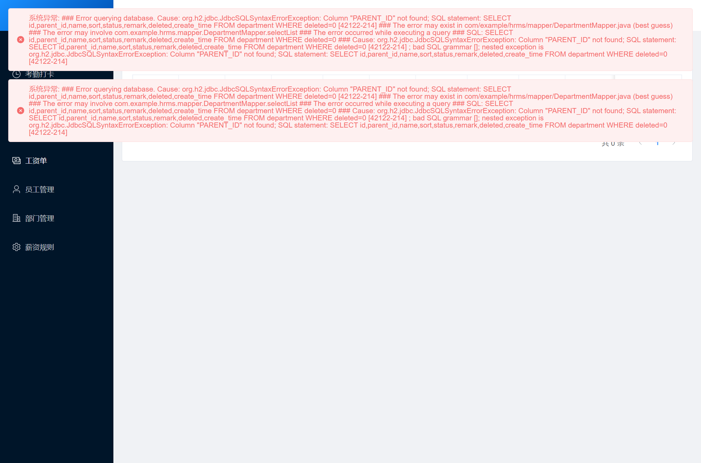
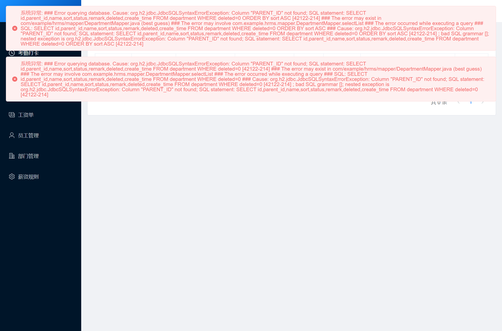
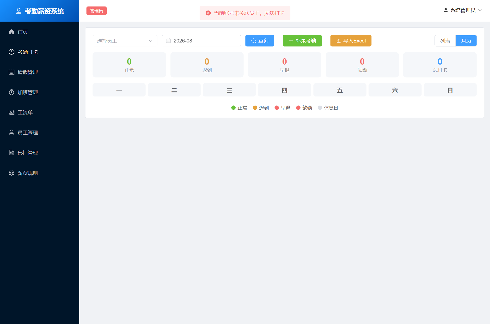
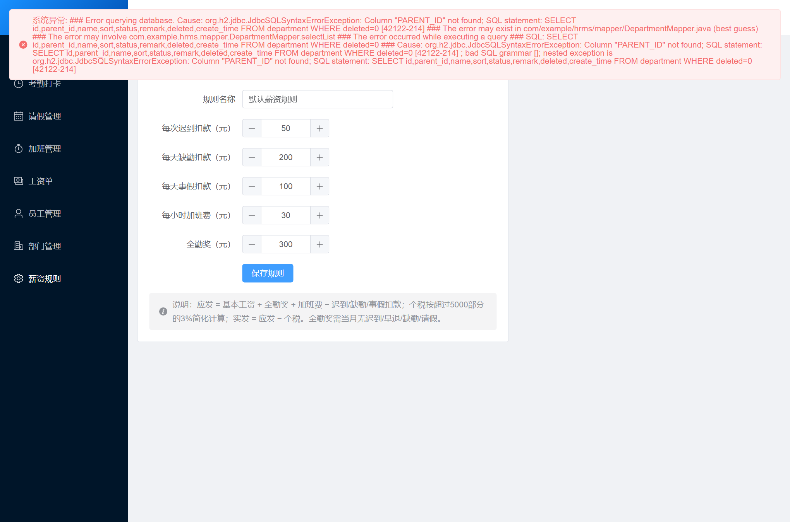

# 中小企业员工考勤与薪资核算管理系统


> 基于 **Spring Boot + Vue 3** 的前后端分离项目，实现员工管理、考勤打卡、请假/加班审批、薪资规则配置与工资自动核算。
>
> **开箱即用**：默认使用内嵌 H2 数据库，无需安装 MySQL，启动即可登录使用；也支持一键切换 MySQL。

## 🖼️ 界面预览

| 登录 | 首页仪表盘（管理员） |
| :---: | :---: |
|  |  |

| 员工管理 | 工资单 |
| :---: | :---: |
|  |  |

| 考勤管理（列表） | 考勤管理（月历） |
| :---: | :---: |
|  |  |

| 薪资规则 | 部门管理 |
| :---: | :---: |
|  | 部门树状结构 |


---

## ✨ 功能特性

| 模块 | 功能 |
| --- | --- |
| 登录鉴权 | JWT 登录、管理员 / 人事 / 员工三级角色、接口权限控制、修改密码 |
| 首页仪表盘 | 管理员看全局统计 + ECharts 图表；员工看本月考勤统计 |
| 员工管理 | 员工增删改查、按部门/关键字检索、新增员工自动生成登录账号、**Excel 批量导入** |
| 部门管理 | **树状部门结构**、部门人数统计、多级部门、排序/状态管理 |
| 考勤管理 | 员工上/下班打卡、迟到/早退自动判定、管理员补录与查询、**月历视图**、**Excel 批量导入** |
| 请假管理 | 员工提交请假申请、管理员/人事审批（批准/驳回） |
| 加班管理 | 员工提交加班申请、管理员/人事审批 |
| 薪资规则 | 配置迟到/缺勤/事假扣款、加班费单价、全勤奖 |
| 工资核算 | 按月自动生成工资单：基本工资 + 全勤奖 + 加班费 − 各项扣款 − 简化个税，支持重算与发放、**Excel 导出** |
| 数据导入导出 | 员工 Excel 导入、考勤 Excel 导入、工资单 Excel 导出 |

---

## 🧰 技术栈

**后端**：Spring Boot 2.7 · Spring Security + JWT · MyBatis-Plus · H2 / MySQL 8 · Apache POI · Java 8
**前端**：Vue 3 · Vite 5 · Element Plus · Vue Router · Pinia · Axios · ECharts 5

---

## 🚀 快速开始（三选一）

> 系统要求：任选其一即可运行。为最大兼容性，后端目标为 **Java 8**，各主流操作系统均可运行。

### 方式一：直接运行已打包的 Jar（最简单，只需 JDK 8+）

```bash
# 在 backend 目录下打包（首次需要 Maven，见方式二）后得到 target/hrms.jar
java -jar backend/target/hrms.jar
```

启动后浏览器访问 **http://localhost:8080** ，即为完整系统（前端已内置在 Jar 中）。

### 方式二：本地开发运行（前后端分离）

**1. 启动后端**（需要 JDK 8 + Maven）
```bash
cd backend
mvn spring-boot:run
# 后端运行在 http://localhost:8080
```

**2. 启动前端**（需要 Node 18+）
```bash
cd frontend
npm install
npm run dev
# 前端运行在 http://localhost:5173 ，已配置代理到后端
```

### 方式三：Docker 一键启动（只需 Docker）

```bash
# 默认使用内嵌 H2
docker compose up -d --build
# 访问 http://localhost:8080

# 如需使用 MySQL：
SPRING_PROFILES_ACTIVE=mysql docker compose --profile mysql up -d --build
```

---

## 📦 一键打包完整可运行 Jar

打包会先构建前端并内置到后端，最终生成单一可运行 Jar：

```bash
# 1) 构建前端（产物自动输出到后端静态目录）
cd frontend && npm install && npm run build

# 2) 打包后端（含前端）
cd ../backend && mvn clean package -DskipTests

# 3) 运行
java -jar target/hrms.jar
```

Windows 用户可直接双击运行根目录下的 `build.bat`（构建）与 `run.bat`（运行）。

---

## 🔑 默认账号

| 角色 | 用户名 | 密码 | 说明 |
| --- | --- | --- | --- |
| 管理员 | `admin` | `admin123` | 系统管理员，拥有所有权限 |
| 人事专员 | `hr` | `hr123456` | 人事专员，可管理员工/考勤/工资等 |
| 员工（张三） | `E001` | `123456` | 技术部，Java开发工程师 |
| 员工（李四…孙七） | `E002` ~ `E005` | `123456` | 各部门普通员工 |

> 首次启动会自动初始化 3 个部门、5 名员工及演示考勤/请假/加班数据。
> 新增员工时会自动创建登录账号：**用户名 = 工号，初始密码 = 123456**。

---

## 🗄️ 数据库说明

- **默认（H2）**：零配置，数据保存在 `backend/data/hrms.mv.db`。可访问 `http://localhost:8080/h2-console` 查看（JDBC URL：`jdbc:h2:file:./data/hrms`，用户名 `sa`，密码空）。
- **切换 MySQL**：以 `mysql` profile 启动即可，程序会自动建库建表并灌入演示数据。

```bash
# 通过环境变量覆盖连接信息（含默认值）
#   MYSQL_HOST=localhost MYSQL_PORT=3306 MYSQL_DB=hrms MYSQL_USER=root MYSQL_PASSWORD=root
java -jar target/hrms.jar --spring.profiles.active=mysql \
     --MYSQL_HOST=localhost --MYSQL_USER=root --MYSQL_PASSWORD=你的密码
```

建表脚本见 `backend/src/main/resources/db/schema.sql`（H2 / MySQL 通用），
另附独立参考脚本 `sql/init_mysql.sql`。

---

## 🧮 薪资核算规则

```
应发工资 = 基本工资 + 全勤奖 + 加班费 − 迟到扣款 − 缺勤扣款 − 事假扣款
个人所得税 = (应发 − 5000) × 3%     （简化计算，应发≤5000 时为 0）
实发工资 = 应发工资 − 个人所得税
```
- 全勤奖：当月无迟到 / 早退 / 缺勤 / 请假才发放。
- 加班费：仅统计**已批准**的加班；事假扣款仅统计**已批准**的事假。
- 各项参数可在「薪资规则」页面自定义。

---

## 📁 项目结构

```
attendance-salary-system/
├── backend/                      # Spring Boot 后端
│   ├── src/main/java/com/example/hrms/
│   │   ├── config/               # 安全、MyBatis-Plus、数据初始化配置
│   │   ├── security/             # JWT 与 Spring Security
│   │   ├── entity/ mapper/ service/ controller/   # 分层代码
│   │   └── common/               # 统一返回、异常处理
│   └── src/main/resources/
│       ├── application.yml        # H2 / MySQL 双 profile 配置
│       ├── db/schema.sql          # 建表脚本
│       └── static/                # 前端打包产物（构建后生成）
├── frontend/                     # Vue 3 前端
│   └── src/{api,router,store,layout,views}
├── sql/init_mysql.sql            # MySQL 参考脚本
├── Dockerfile / docker-compose.yml
├── build.bat / run.bat           # Windows 便捷脚本
└── README.md
```

---

## 📡 主要接口

| 方法 | 路径 | 说明 |
| --- | --- | --- |
| POST | `/api/auth/login` | 登录获取 token |
| GET | `/api/dashboard/stat` | 首页统计 |
| GET/POST/PUT/DELETE | `/api/employees` | 员工管理 |
| GET | `/api/departments` | 部门 |
| POST | `/api/attendance/check-in` `/check-out` | 上/下班打卡 |
| GET/POST/PUT | `/api/leaves` | 请假与审批 |
| GET/POST/PUT | `/api/overtimes` | 加班与审批 |
| GET/PUT | `/api/salary-rule` | 薪资规则 |
| POST | `/api/payrolls/generate?month=YYYY-MM` | 生成/重算工资单 |
| GET | `/api/payrolls` | 工资单查询 |

> 除登录接口外，所有 `/api/**` 需在请求头携带 `Authorization: Bearer <token>`。

---

## 📄 License

本项目仅用于学习与毕业设计演示，可自由使用与修改。
